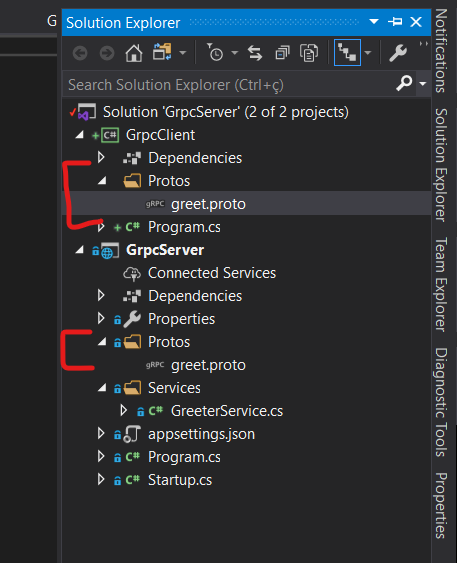

### Create a server project

With a Visual Studio template for grpc.projects

 - Create a new project	
 - Create a new console app 
   - Add a 3 packages
     - Google.Protobuf
	 - Grpc.Net.Client
	 - Grpc.Tools
	- Add the comtract in client project
	- Copy the "Grpc.Server" path "Protos\*.photo" to client
	- In .proto file configure the property "GRPC Stub Classes" to "Client Only"
	- 
	- In look the project property ( in Client Project )
	- Image "Annotation 2019-12-29 160927-3.png"
	- Programmer the client
	- In the soluction change the "start up application" to start the both project
		- When configure the server as the first and the client is the second, follow image
		[Annotation 2019-12-29 160927-4.png]
	- Start application, and the result is:
	[Annotation 2019-12-29 160927-5.png]

### When create a new Service	
When you create a new .proto file, you need configure the property, as with a image bellow
[Annotation 2019-12-29 160927-6.png]
Create a new "*Service" file
Add the new service in Startup file